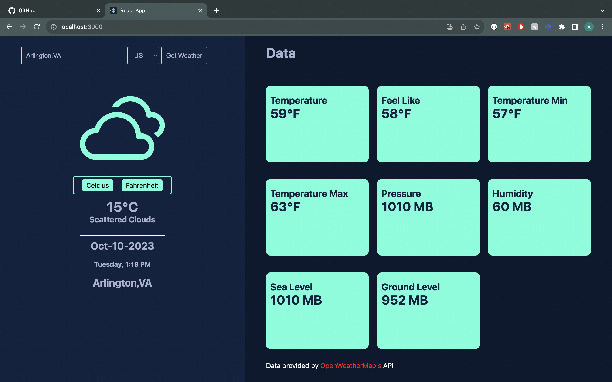

# Weather-App

This is a full-stack weather application that provides hourly weather data for a specific location. The application is built using React.js for the frontend, Node.js for the backend, and leverages OpenWeatherMap's API to fetch the weather data. Redis is also used for caching the API responses to optimize performance and provide a seamless user experience.

## Link

https://weather-app-client-red.vercel.app/

## Overview



## Installation and Setup

- Clone this repository.

```
> git clone https://github.com/0xabel/weather-app.git
```

- Install the necessary dependencies in both the client-side and server-side.

### Client installation

```
> cd weather-app
> cd client
> npm install
```

### Server installation

```
> cd weather-app
> cd server
> npm install
```

- Add environment variables in the .env file that's located in the server folder.

```
WEATHER_API_KEY=
GOOGLE_API_KEY=
REDIS_PASSWORD =
REDIS_HOST =
REDIS_PORT =
```

## Start application

- Go to the client folder and type in

```
> npm start
```

- Go to the server folder and type

```
> npm start
```

## Usage

- Open the application in your web browser.
- Enter a location to get the current weather data.
- The application will display the weather data for the entered location.

## Hire me

Hi 👋, My name is Abel and I'm an aspiring software developer with a decade-long internet journey under my belt. I embarked on my coding journey in 2019 and have been hooked ever since. I've had the privilege of interacting and learning from many brilliant developers across platforms like Discord, GitHub, and Twitter.

Over the years, I've picked up a set of technologies and tools that I'm quite proud of.

### Technologies and tools

- HTML
- CSS
- JavaScript
- React / Redux (toolkit)
- Node.JS
- Electron
- MongoDB
- Redis
- Notion

### Learning

- Data Structures and Algorithms
- Golang
- AWS

### Services

- Web Development (static / apps)
- Desktop App Development
- Web Scraping
- Custom programs

### Contact

If you're interested in hiring me, feel free to reach out to me at twitchyshot@gmail.com. I'm always up for a new challenge and I'm excited about the possibilities!

### Bye

...❤️
